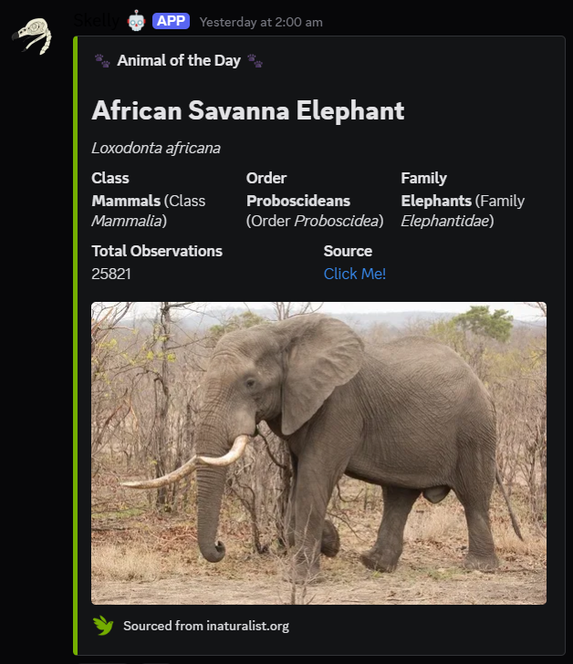
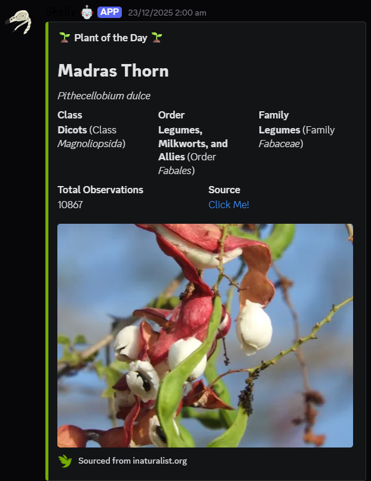
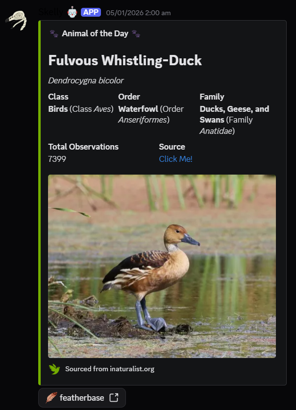
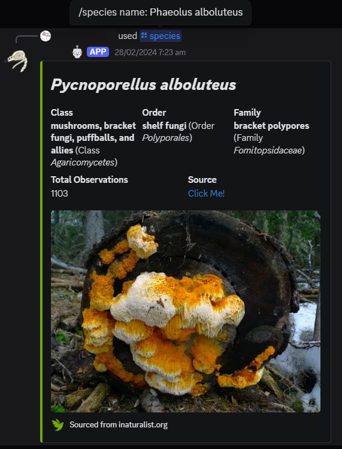

# iNaturalist.gg 🌿

**iNaturalist.gg** is a collection of web-application code that utilizes the iNaturalist API to implement games and features for a Discord.js bot.

---

## 📸 Interface & Demos

### 🐾 Animal/Plant/Fungi/etc. of the Day
Fetch a random species from all recent observations matching a certain filter, e.g. kingdom *Plantae*. This can run on an interval automatically for timed posts on any group of life.
As an added feature, *Aves* observations will automatically attach a [FeatherBase](https://www.featherbase.info/el/home) button using the bird's binomial nomenclature in the link. Additionaly, *Fungi* observations will add a section linking to the Wikipedia page for the list of edible mushrooms.

  
  
   
  <i>Animal/Plant/Fungi of the Day</i>

 

   
  <i>Example of the FeatherBase link button</i>

---

### 🧬 /species
Get comprehensive data on individual species, including taxonomic information, community observation count, and a cover image. This command allows fuzzy string matching to guess what the user is looking for, which accounts for typos and taxonomic changes, as shown in the picture below.
This command also works for general taxonomical groups, e.g. `/species Felis` would show all the applicable information for a genus instead of a species.

   
  <i>Example of a user running the /species command with outdated binomial nomenclature</i>

---

### ⌛ Guessing Game
Guess the species from randomly picked 'Research Grade' observations matching a certain filter, hard-coded using links. As implemented, the game will show users observations from the 'Skulls and Bones' project as well as observations marked with Bone under 'Presence of Evidence', effectively creating a skull and bone ID game. This also links to a separate function, `addPoint`, to reward players for correct guesses. Fuzzy string matching is implemented to accept typos within a certain threshold, allow for multiple common names, or check for more general taxonomical names for a singular species, e.g. guessing 'Cow', 'cow', or '*Bos taurus*' will all reward the player with a point.

---

## 🛠️ Tech Stack

* **API:** [iNaturalist API v1](https://api.inaturalist.org/v1/docs/)
* **Framework:** [Discord.js](https://discord.js.org/)
* **Deployment:** Heroku
* MongoDB, Express.js, React, Node.js
